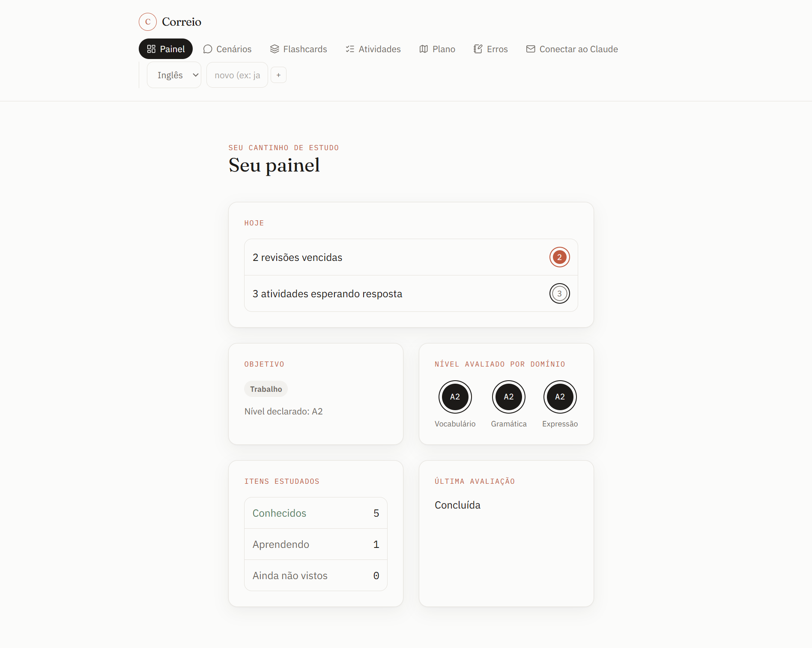
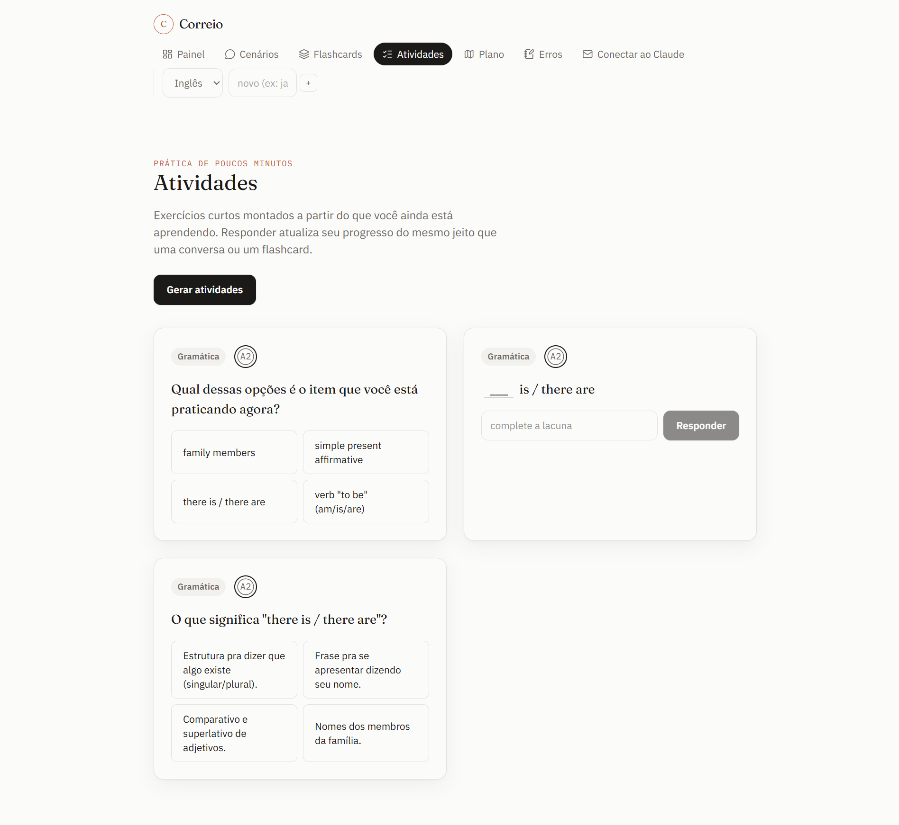
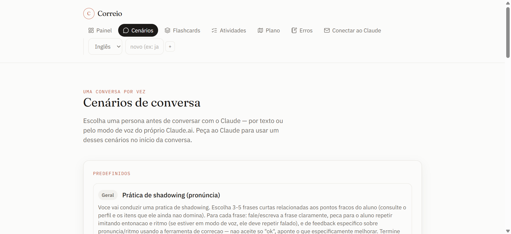
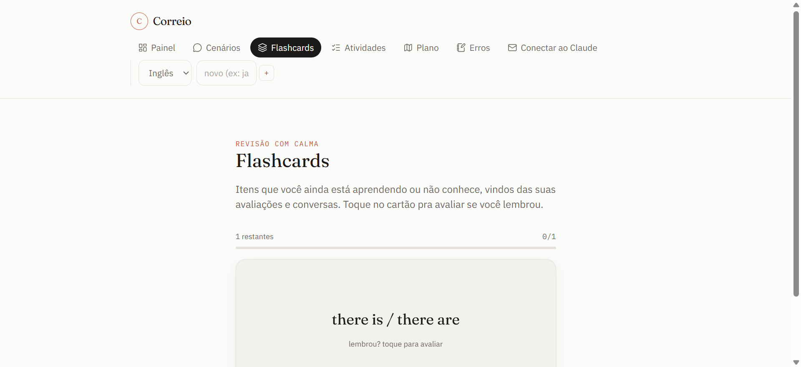
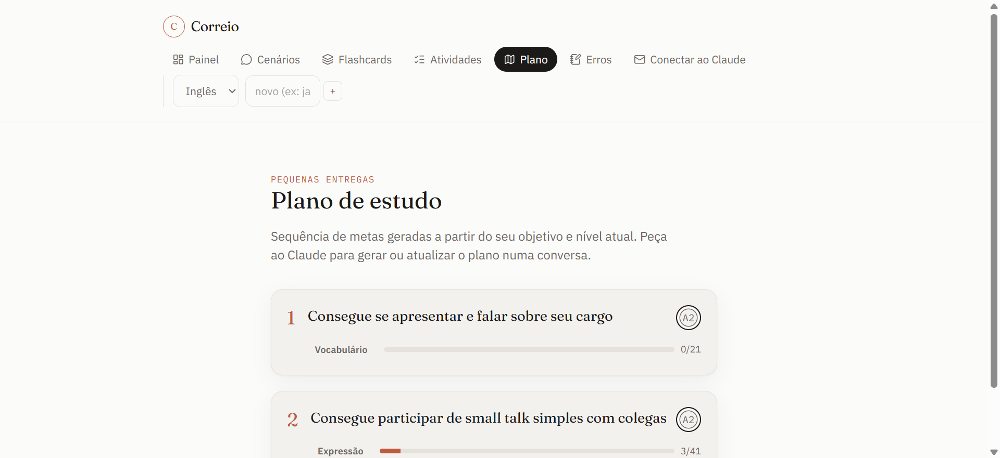
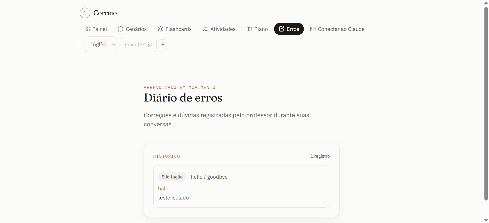
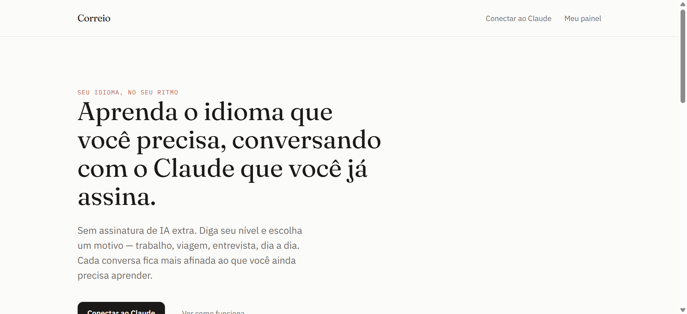
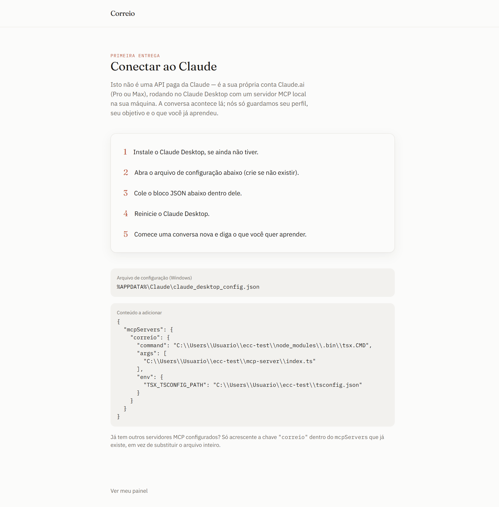

# Correio

**Plataforma de estudo de idiomas adaptativa, pessoal e 100% local.**
Sem API paga da Claude, sem servidor exposto na internet — o "professor" é a
sua própria sessão do **Claude Desktop** (conta Pro/Max), conectada a um
**servidor MCP que roda na sua máquina**. O sistema só guarda seu perfil,
seu objetivo e o que você já aprendeu; a conversa em si acontece direto no
Claude.



<p>
  
  
  
  
  
  
</p>

## Índice

- [Como funciona](#como-funciona)
- [Funcionalidades](#funcionalidades)
- [Capturas de tela](#capturas-de-tela)
- [Stack](#stack)
- [Configuração](#configuração)
- [Scripts](#scripts)
- [Estrutura do projeto](#estrutura-do-projeto)
- [Testes](#testes)
- [Design](#design)
- [Limitações conhecidas](#limitações-conhecidas)

## Como funciona

```
Claude Desktop (sua conta Pro/Max)
        │  stdio (processo local, sem rede)
        ▼
mcp-server/index.ts  →  21 tools (perfil, avaliação, cenários, correção, plano de estudo)
        │
        ▼
Supabase Postgres (service-role key, sem RLS — uso pessoal, um usuário só)
        ▲
        │
Next.js dashboard (npm run dev, só acessado via localhost)
```

O Claude conduz a conversa naturalmente e chama as tools (via MCP) pra
lembrar quem você é, o que já foi coberto e o que ensinar a seguir. O
dashboard web é só bootstrap e visualização — flashcards e atividades viram
telas de verdade lá, porque são mais rápidas de usar do que via chat.

## Funcionalidades

- **Onboarding + avaliação adaptativa de nível** — você diz seu objetivo
  (trabalho, viagem, entrevista, dia a dia ou personalizado) e nível
  autodeclarado; o Claude vai testando vocabulário/gramática/expressão e
  ajusta a dificuldade por domínio conforme você acerta ou erra.
- **Perfis por idioma** — um perfil (nível, objetivo, progresso) por idioma
  alvo, no estilo Duolingo. Troque de idioma ativo direto no dashboard.
- **Cenários e personas de conversa** — entrevista de emprego, pedir
  informação na rua, check-in de hotel, cafeteria, e mais — por texto ou
  pelo modo de voz nativo do Claude Desktop. Inclui prática de shadowing
  (pronúncia) e leitura/escuta guiada (input um nível acima do seu, i+1).
  Dá pra criar cenários personalizados também.
- **Flashcards** — os itens que você ainda não domina, com virada em 3D,
  histórico personalizado por cartão, repetição espaçada por fator de
  facilidade (SM-2-lite) e um botão de pronúncia (Web Speech API nativa do
  navegador, sem custo extra).
- **Atividades** — múltipla escolha, complete a lacuna (cloze) e "qual o
  significado", geradas a partir dos seus pontos fracos. Motor extensível:
  um tipo de exercício novo é só um gerador + uma linha de registro, sem
  reescrever nada.
- **Professor especialista** — o Claude corrige usando a taxonomia de
  feedback corretivo de Lyster & Ranta (1997): correção explícita, recast,
  pedido de esclarecimento, feedback metalinguístico, elicitação,
  repetição. Fica registrado num diário de erros no dashboard.
- **Plano de estudo** — sequência de metas "consigo fazer" (Can-Do,
  padrão CEFR) geradas a partir do seu objetivo e nível, cruzadas com os
  cenários disponíveis.
- **Priorização por frequência** — itens mais relevantes/frequentes têm
  prioridade na hora de escolher o que praticar.

## Capturas de tela

<table>
  <tr>
    <td width="50%">
      <p align="center"><strong>Painel</strong></p>
      
    </td>
    <td width="50%">
      <p align="center"><strong>Atividades</strong></p>
      
    </td>
  </tr>
  <tr>
    <td width="50%">
      <p align="center"><strong>Cenários de conversa</strong></p>
      
    </td>
    <td width="50%">
      <p align="center"><strong>Flashcards</strong></p>
      
    </td>
  </tr>
  <tr>
    <td width="50%">
      <p align="center"><strong>Plano de estudo</strong></p>
      
    </td>
    <td width="50%">
      <p align="center"><strong>Diário de erros</strong></p>
      
    </td>
  </tr>
  <tr>
    <td width="50%">
      <p align="center"><strong>Landing</strong></p>
      
    </td>
    <td width="50%">
      <p align="center"><strong>Conectar ao Claude</strong></p>
      
    </td>
  </tr>
</table>

## Stack

| Camada | Tecnologia |
|---|---|
| Dashboard web | [Next.js](https://nextjs.org) 16 (App Router), React 19 |
| Servidor MCP | [`@modelcontextprotocol/server`](https://modelcontextprotocol.io) via stdio, rodado com [tsx](https://github.com/privatenumber/tsx) (sem build step) |
| Banco de dados | [Supabase](https://supabase.com) (Postgres), acessado via service-role key |
| Estilo | [Tailwind CSS v4](https://tailwindcss.com) + design system próprio |
| Validação | [Zod](https://zod.dev) nos schemas de entrada das tools MCP e das rotas de API |
| Testes | [Vitest](https://vitest.dev) — lógica pura e integração real contra Supabase |

## Configuração

### 1. Instalar dependências

```bash
npm install
```

### 2. Criar um projeto Supabase

Crie um projeto gratuito em [supabase.com](https://supabase.com).

### 3. Aplicar o schema

No **SQL Editor** do painel do Supabase (ou via CLI), rode nesta ordem:

```
supabase/migrations/0001_init.sql
supabase/migrations/0002_scenarios.sql
supabase/migrations/0003_activities.sql
supabase/migrations/0004_coaching_plans_and_pacing.sql
supabase/migrations/0005_schema_hardening.sql
supabase/migrations/0006_skill_item_meanings.sql
supabase/migrations/0007_spaced_repetition_sm2.sql

supabase/seed/skill_items_en.sql
supabase/seed/skill_items_meanings.sql
supabase/seed/scenarios.sql
supabase/seed/scenarios_fase4.sql
supabase/seed/activity_types.sql
```

### 4. Configurar variáveis de ambiente

Copie `.env.example` para `.env.local` e preencha com os dados do seu
projeto (**Project Settings → API** no painel do Supabase):

```bash
cp .env.example .env.local
```

```
NEXT_PUBLIC_SUPABASE_URL=https://xxxxx.supabase.co
SUPABASE_SERVICE_ROLE_KEY=sb_secret_...   # a chave secreta, nunca a publishable/anon
```

### 5. Conectar ao Claude Desktop

Instale o [Claude Desktop](https://claude.ai/download) se ainda não tiver,
depois rode o dashboard:

```bash
npm run dev
```

Abra **http://localhost:3000/connect** — a página gera o bloco JSON certo
(com o caminho absoluto do seu projeto) pra colar em
`%APPDATA%\Claude\claude_desktop_config.json`. Reinicie o Claude Desktop e
comece uma conversa nova.

## Scripts

| Comando | O que faz |
|---|---|
| `npm run dev` | Sobe o dashboard web em `localhost:3000` |
| `npm run build` | Build de produção do dashboard |
| `npm run start` | Roda o build de produção |
| `npm run mcp` | Roda o servidor MCP standalone (útil pra testar tools manualmente) |
| `npm test` | Roda os testes (`vitest`) |
| `npm run lint` | Roda o ESLint |

## Estrutura do projeto

```
mcp-server/index.ts             → entrypoint stdio, carrega .env.local, registra as 21 tools
lib/mcp/
  tools.ts                      → onboarding + avaliação adaptativa (7 tools)
  scenarios.ts                  → cenários/personas de conversa (5 tools)
  coaching.ts                   → professor especialista (3 tools)
  study-plan.ts                 → planos de estudo (3 tools)
  language-profiles.ts          → perfis por idioma, estilo Duolingo (3 tools)
  shared.ts                     → helpers (getLocalUserId, json, dbFail)
lib/profile/
  active-profile.ts             → idioma ativo (arquivo local compartilhado MCP/dashboard)
  language-profiles.ts          → consulta/criação de perfil por idioma (Supabase)
lib/assessment/
  adaptive.ts                   → heurística de nível por domínio (pura, testada)
  spaced-repetition.ts          → intervalos de repetição espaçada (pura, testada)
lib/activities/                 → motor de atividades extensível (types/registry/generators)
lib/study-plan/                 → catálogo Can-Do, montagem do plano (pura, testada), progresso
lib/progress/record-response.ts → motor único de escrita de progresso
lib/skill-items/rank.ts         → critério único de priorização de item
lib/supabase/server.ts          → cliente Supabase (service-role)
lib/http/same-origin.ts         → mitigação de CSRF local
app/
  page.tsx, connect/            → landing e instruções de conexão
  dashboard/                    → painel, cenários, flashcards, atividades, plano, erros
  dashboard/_components/        → header/nav, cards, seletor de idioma (compartilhados)
  api/                          → rotas que mutam progresso (flashcards, atividades)
supabase/
  migrations/                   → schema completo, em ordem
  seed/                         → conteúdo inicial (itens, cenários, tipos de atividade)
docs/screenshots/                → imagens usadas neste README
```

## Testes

```bash
npm test
```

A suíte cobre tanto lógica pura (avaliação adaptativa, repetição espaçada,
montagem do plano de estudo) quanto **integração real contra o Supabase**
configurado em `.env.local` — os testes de MCP tools e das rotas de API
criam dados de verdade, exercitam o fluxo completo (ex.: onboarding →
avaliação → resposta) e limpam depois. Não há mocks de banco: se o schema
ou uma migration quebrar algo, o teste falha de verdade.

## Design

Visual minimal e claro, com a tinta escura como cor de texto e o
vermelho-selo (`--stamp`) como único acento de cor — usado com moderação em
CTAs, no carimbo de nível CEFR e em estados de atenção. Tipografia:
Fraunces nos títulos, IBM Plex Sans no corpo, IBM Plex Mono em rótulos e
dados. O carimbo circular de nível CEFR é a assinatura visual da marca; ver
`app/globals.css` para os tokens e componentes (`paper-card`, `button-primary`,
`field-control`, `postmark`, `envelope-tag`).

## Limitações conhecidas

- Só funciona com o **Claude Desktop** — não com Claude.ai (navegador) nem
  os apps mobile, porque exigiriam voltar a expor um servidor remoto com
  OAuth.
- Dataset de conteúdo hoje só cobre **inglês** (~54 itens semeados).
- Repetição espaçada usa SM-2-lite (fator de facilidade por item, ajustado a
  cada resposta), não o modelo estatístico completo do FSRS — que otimizaria
  os parâmetros automaticamente por aluno em vez de usar constantes fixas.
